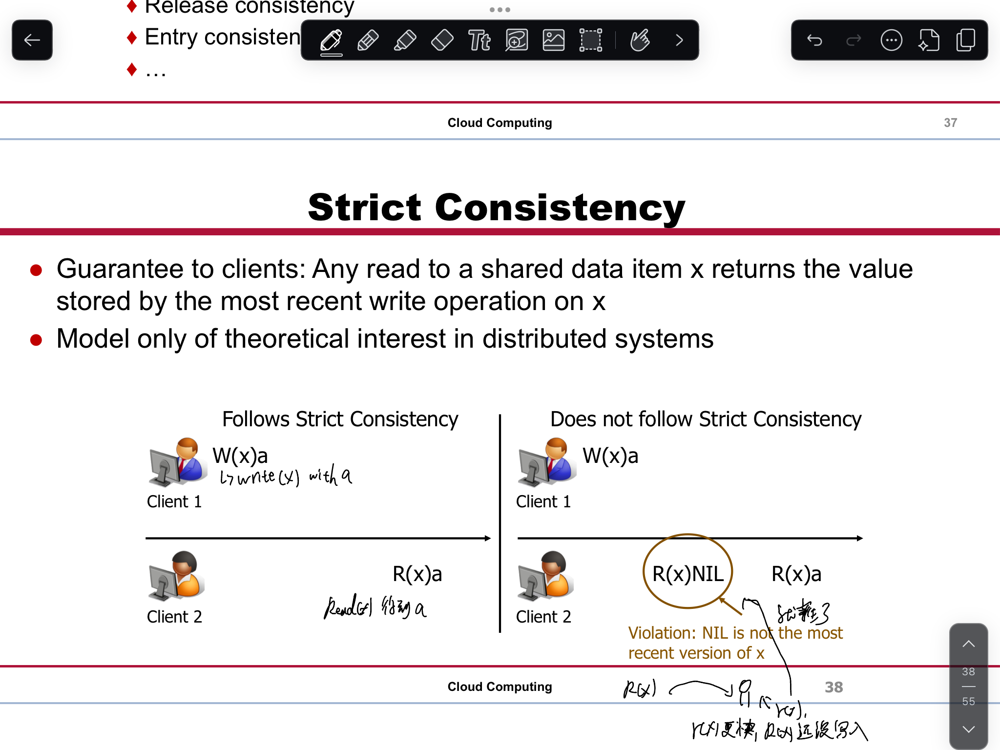
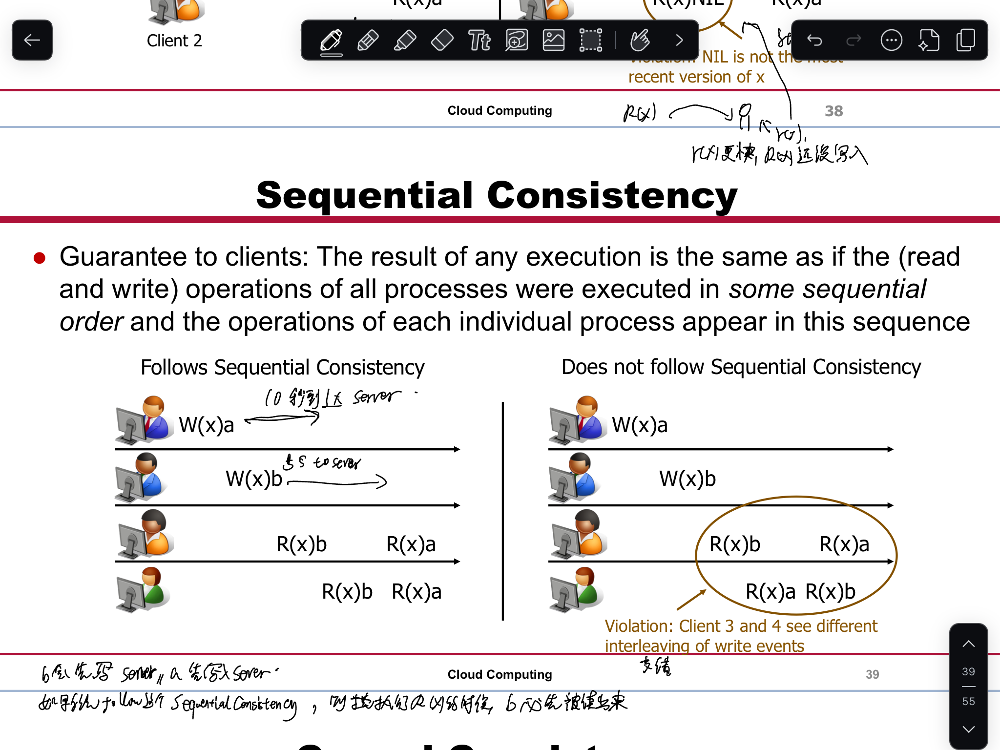
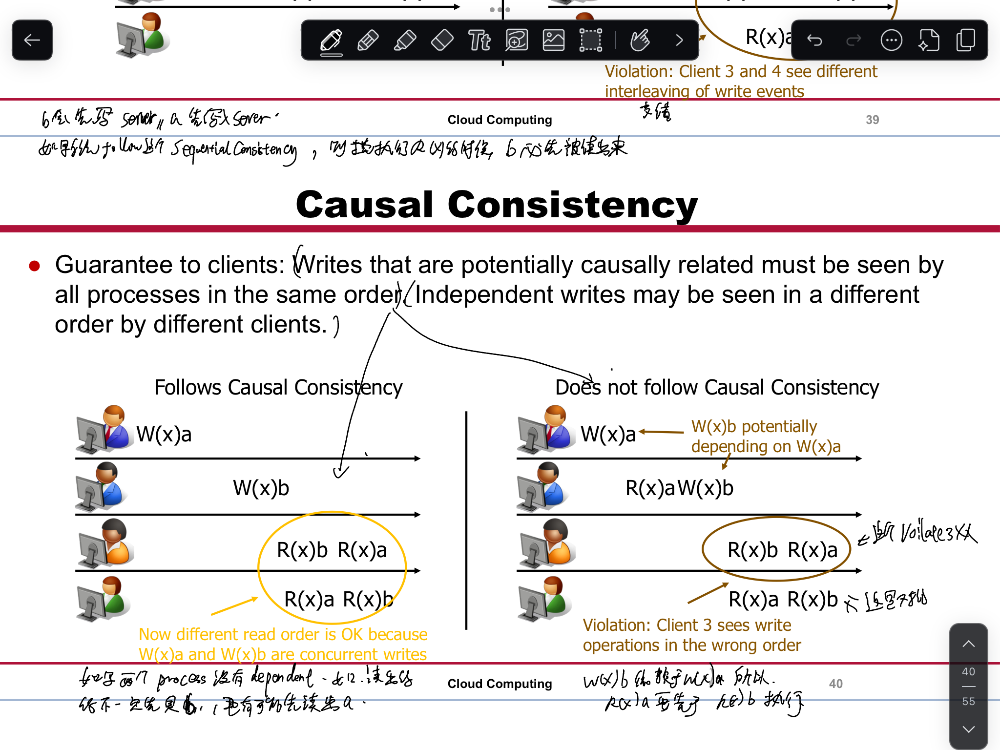

# 1 Replication

Server-initiated replication
- server端自己进行数据复制 
- Mainly used to reduce server load
- Server decides among a set of replica servers
- Copies are created by a server when popularity of data item increases

Client-initiated replication(== client caches)
- Replica is created as result of a client‘s interaction
- Server has no control of cached copy anymore →Stale replicas handled by expiration date
- Traditional examples: Web proxies

# 2 Consistency

## 2.1 Data-Centric Consistency Models

Talk about consistency from a global perspective
Provides guarantees how a sequence of read/write operations are perceived by multiple clients

Strong consistency models
Operations on shared data are synchronized
Strict consistency (related to time)
Sequential consistency (what we are used to)
Causal consistency (maintains only causal relations)

### 2.1.1 Strict Consistency

- **Definition**: Every read operation on shared data always returns the most recent write, reflecting real-world time.
- **Characteristics**:
    - Operations appear to be instantaneous.
    - All processes in the system agree on the same order of operations.
- **Example**: If process P1 writes a value x=10, all subsequent reads by any process immediately reflect x=10.
- **Challenges**: Difficult to implement in distributed systems due to latency and clock synchronization issues.

### 2.1.2 Sequential Consistency

- **Definition**: Operations are executed in some sequential order, and all processes agree on this order. However, this order doesn't need to match real-world time.
- **Characteristics**:
    - Ensures operations are **logically** consistent, but not necessarily instantaneous.
    - Processes may see operations interleaved, but the interleaving is consistent across all processes.
- **Example**: If P1 writes x=10 and P2 writes x=20, all processes will see these writes in the same order (e.g., either x=10 first or x=20 first).
- **Use Case**: Common in shared-memory systems and concurrent programming.

### 2.1.3 Causal Consistency

- **Definition**: Only maintains the order of operations that are causally related. Operations that are independent (unrelated) can appear in different orders to different processes.
- **Characteristics**:
    - **Causality**: If operation AAA causally affects operation BBB, all processes must see AAA before BBB.
    - Concurrent operations (those with no causal relationship) can be observed in any order.
- **Example**:
    - P1 writes x=10
    - P2 reads x=10and then writes y=20
    - All processes must see x=10 before y=20, but P3's write z=30 (independent of P1and P2) can appear in any order.
- **Use Case**: Distributed systems with eventual consistency, like DynamoDB or Cassandra.

### 2.1.4 Comparison:

|**Model**|**Order Guarantee**|**Implementation Difficulty**|**Use Cases**|
|---|---|---|---|
|Strict Consistency|Real-time order|High (requires synchronized clocks)|Systems requiring immediate updates|
|Sequential Consistency|Logical order|Medium|Shared memory systems|
|Causal Consistency|Causal order (related ops)|Low/Medium|Distributed databases, eventual consistency systems|

Understanding these models is critical for designing distributed systems that balance performance, consistency, and fault tolerance.

## 2.2 Client-centric consistency models
Talk about consistency from a client‘s perspective
Provides guarantees how a singleclientperceives the state of a replicated data item