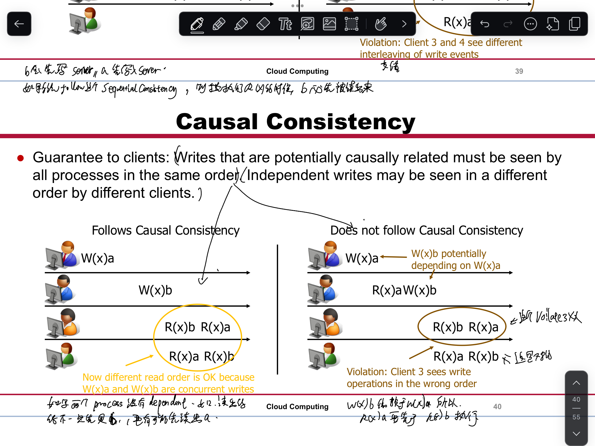

# 1 总结 

- Scaling-out to more virtual resources: scalability and fault tolerance
    - Load balancing for replicated stateless components
    - Load balancing and data consistency models for replicated stateful components
- The higher the consistency level, the less scalable replicated services are
- System components fail eventually, decide for either availability or consistency as a system’s designer

# 2 Achieve Scalability?

Stateless components
- Component maintains no internal state beyond a request
- Examples: DNS server, web server with static data, …

Stateful components
- Component maintains state beyond request (state is required to process the next request)
- Examples: mail server, stateful web server, DBMS, …

# 3 Stateless Load Balancing

# 4 Scalability with Stateful Components (Database Partitioning)

Database is stateful (stores data beyond requests) → requests from the same client must be handled by the same instance of the database server

Idea: Divide data into distinct, independent part
Each server is responsible for one or more parts

## 4.1 Popular Partitioning Schemes

# 5 Replication

Partitioning helps with scalability but not availability
- Data is only stored in one location
- If a host goes down, its partitions are gone
Replication can improve both scalability and availability

Server-initiated replication
- server端自己进行数据复制 
- Mainly used to reduce server load
- Server decides among a set of replica servers
- Copies are created by a server when popularity of data item increases

Client-initiated replication(== client caches)
- Replica is created as result of a client‘s interaction
- Server has no control of cached copy anymore →Stale replicas handled by expiration date
- Traditional examples: Web proxies

# 6 Consistency

## 6.1 Data-Centric Consistency Models

Talk about consistency from a global perspective
Provides guarantees how a sequence of read/write operations are perceived by multiple clients

Strong consistency models
Operations on shared data are synchronized
Strict consistency (related to time)
Sequential consistency (what we are used to)
Causal consistency (maintains only causal relations)

### 6.1.1 Strict Consistency

- **Definition**: Every read operation on shared data always returns the most recent write, reflecting real-world time.
- **Characteristics**:
    - Operations appear to be instantaneous.
    - All processes in the system agree on the same order of operations.
- **Example**: If process P1 writes a value x=10, all subsequent reads by any process immediately reflect x=10.
- **Challenges**: Difficult to implement in distributed systems due to latency and clock synchronization issues.

### 6.1.2 Sequential Consistency

- **Definition**: Operations are executed in some sequential order, and all processes agree on this order. However, this order doesn't need to match real-world time.
- **Characteristics**:
    - Ensures operations are **logically** consistent, but not necessarily instantaneous.
    - Processes may see operations interleaved, but the interleaving is consistent across all processes.
- **Example**: If P1 writes x=10 and P2 writes x=20, all processes will see these writes in the same order (e.g., either x=10 first or x=20 first).
- **Use Case**: Common in shared-memory systems and concurrent programming.

### 6.1.3 Causal Consistency

- **Definition**: Only maintains the order of operations that are causally related. Operations that are independent (unrelated) can appear in different orders to different processes.
- **Characteristics**:
    - **Causality**: If operation AAA causally affects operation BBB, all processes must see AAA before BBB.
    - Concurrent operations (those with no causal relationship) can be observed in any order.
- **Example**:
    - P1 writes x=10
    - P2 reads x=10and then writes y=20
    - All processes must see x=10 before y=20, but P3's write z=30 (independent of P1and P2) can appear in any order.
- **Use Case**: Distributed systems with eventual consistency, like DynamoDB or Cassandra.

### 6.1.4 Comparison:

|**Model**|**Order Guarantee**|**Implementation Difficulty**|**Use Cases**|
|---|---|---|---|
|Strict Consistency|Real-time order|High (requires synchronized clocks)|Systems requiring immediate updates|
|Sequential Consistency|Logical order|Medium|Shared memory systems|
|Causal Consistency|Causal order (related ops)|Low/Medium|Distributed databases, eventual consistency systems|

Understanding these models is critical for designing distributed systems that balance performance, consistency, and fault tolerance.

## 6.2 Client-centric consistency models
Talk about consistency from a client‘s perspective

Provides guarantees how a single client perceives the state of a replicated data item
1. Eventual Consistency
2. Monotonic Reads
3. Monotonic Writes
4. Read Your Writes
5. Writes Follow Reads

Monotonic-read consistency
If a process reads x, any future read on x by the process will return the same or a more recent value

Monotonic-write consistency
A write by a process on x is completed before any future write operations on x by the same process

Read your writes
A write by a process on x will be seen by a future read operation on x by the same process

Writes follow reads
A write by a process on x after a read on x takes place on the same or more recent value of x that was read

|Guarantee|Description|Example Use Case|
|---|---|---|
|Eventual Consistency|All replicas converge eventually.|DNS updates across the internet.|
|Monotonic Reads|Subsequent reads show the same or newer data.|Emails showing consistent "read" status.|
|Monotonic Writes|Writes are applied in order.|Profile updates apply sequentially.|
|Read Your Writes|Reads reflect the client’s own writes.|Status updates are immediately visible.|
|Writes Follow Reads|Writes are consistent with previous reads.|Editing the latest version of a document.|

### 6.2.1 Eventual Consistency

- Ensures that if no updates are made to a data item, all replicas will eventually converge to the same value.
- It does **not guarantee immediate consistency** after a write.
- Example: DNS updates may take time to propagate but eventually become consistent.

**Guarantee:** Data becomes consistent **over time**, assuming no new updates.

---

Guarantee for the client: All replicas will eventually reach the most recent state

Apart from that there is no guarantee
- Client can read old data
- Client can loose its updates

Model enjoys popularity in the cloud world as it can be implemented easily and allows high scalability

### 6.2.2 Monotonic Reads

Guarantee for the client: A read operation by one client is made only at a server containing all writes that were seen by previous reads

Server 1 中的 对于 x1的写操作, 必须已经在 server2 上同步了,   server2 对于其他的 x值的 read 才有效.  尽管 这两个x值不一样. 

---

- Ensures that if a client reads a value, any subsequent read will see the **same or a newer value**.
- Prevents the client from observing values that move "backward in time."
- Example: A user sees an email as "read," and it remains "read" even if they switch between devices.

**Guarantee:** Reads are **non-decreasing** in value.

### 6.2.3 Monotonic Writes

Guarantee for the client:A write operation by a client on data item x is completed before successive write operations on x by the same client

- Ensures that a client’s writes are applied **in the order they were issued**.
- Prevents reordering of writes, even in a distributed system.
- Example: If a user updates their profile, the system ensures changes are applied sequentially.

**Guarantee:** Writes are applied in a **monotonically increasing order**.

Server 1 中的 对于 x1的写操作, 必须已经在 server2 上同步了,   server2 对于其他的 x值的 write  才有效.  尽管 这两个x值不一样. 

### 6.2.4 Read Your Writes

Guarantee for the client: The effect of a write operation by a client on data item x will always be seen by a successive read of x by the same client

- Ensures that after a client writes to a data item, any subsequent read will reflect that write.
- Example: After posting a status update, a user immediately sees their post. 

**Guarantee:** A client **always sees its own writes**.

### 6.2.5 Writes Follow Reads

Guarantee for the client: If a read on x precedes a write, then that write is performed after all writes that preceded the read

- Ensures that if a client reads a value and then writes to the same data item, the write will be based on the value that was read or something newer.
- Example: ==A user edits a document they just read, and the edits are applied to the most recent version.==

**Guarantee:** Writes are **causally consistent** with previous reads.

### 6.2.6 scalability, availability, consistency,

scalability 就是很多 worker node 
consistency 就是 各个 node 之间 data consistent 

Consistency and scalability are often at odds with each other in distributed systems.
==Consistency and scalability are often opposite goals ==in distributed systems.

- In general, the stricter the consistency model, the more it impedes the scalability of a system
    - More consistency requires more synchronization
    - While the data is synchronized, some client requests may be answered
- Databases of the 80s and 90s put strong emphasis on consistency, lived with limited scalability/availability
- Today‘s cloud databases often sacrifice consistency in favor of scalability and availability

## 6.3 CAP Theorem

In a distributed system, it is impossible to provide all three of the following guarantees at the same time:
- Consistency: Write to one node, read from another node will return something no older than what was written
- Availability: Non-failing node will send proper response (no error or timeout)
- Partition tolerance (就是 多 Partition,  约等于 scalability) : Keep promise of either consistency or availability in case of network partition

- Illustration of CA (consistency and availability)
    - Example: Replicated DBMS
    - Provided all servers can communicate, it is possible to achieve consistency and availability

- Illustration of PC (partition tolerance and consistency)
    - Example: Pessimistic locking of distributed databases
    - System can provide consistency even if some nodes are temporarily unreachable
    - However, some requests may not be answered due to unreachable nodes (violates availability property)

- Illustration of AP (availability and partition tolerance)
    - Example: DNS system  (多个 DNS server )
    - System continues to work even when some DNS servers are offline (availability)
    - System tolerates network outages 停止供应期 断电 (partition tolerance)
    - DNS makes extensive use of caching to achieve partition tolerance: Non-authoritative DNS server may answer request with old data (violates consistency)